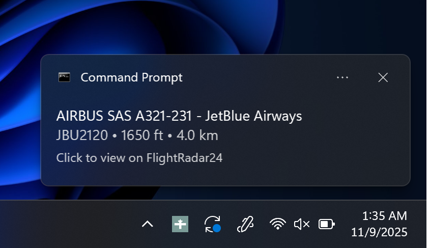
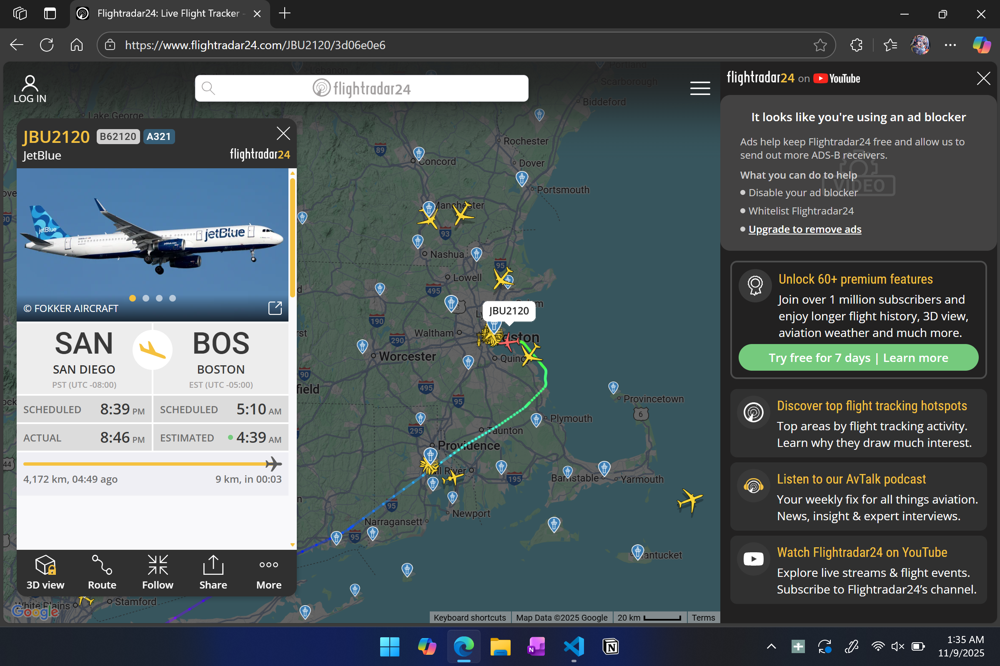
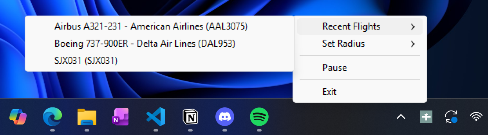
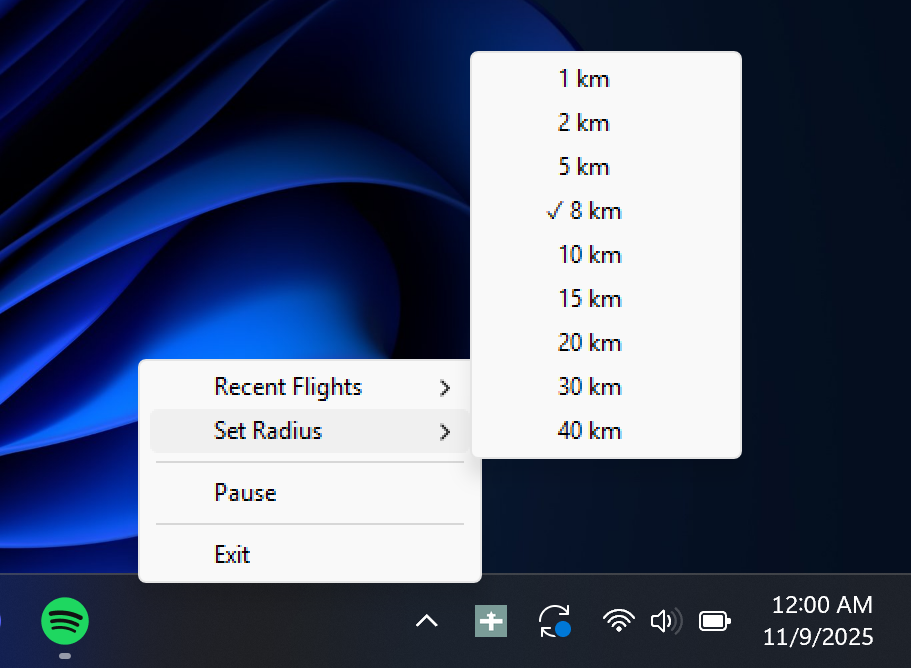

# Nearby Flight Notification

<p align="center">
  
  <br>
  <em>Get instant notifications when aircraft enter your area</em>
</p>

A Python desktop application that monitors aircraft overhead in real-time and delivers Windows notifications when planes enter a user-defined radius.

## Features

- **Real-time aircraft tracking** using OpenSky Network API
- **Windows toast notifications** click them for FlightRadar24 tracking
- **Hybrid data enrichment** combining live ADS-B flight data to match it with aircraft metadata from OpenSky dataset.
- **Intelligent airline identification** if ADS-B data cannot be matched to OpenSky dataset, reconstruct flight operator (Southwest, Emirates) using ICAO code in callsign
- **Geospatial filtering** using Haversine distance calculations (accurate for earth)
- **Customizable monitoring radius** (adjustable in system tray)

## Screenshots

### Click to Track on FlightRadar24

Click any notification or recent flight to instantly view live tracking on FlightRadar24:

<p align="center">
  
  <br>
  <strong style="font-size: 2.0em; margin: 6px 0; display: inline-block;">↓</strong>
  <br>
  
  <br>
  <em>Live map, route, and flight details from FlightRadar24</em>
</p>

### System Tray Menu
<p align="center">
  
  <br>
  <em>Access recent flights and adjust settings</em>
</p>

### Radius Selection
<p align="center">
  
  <br>
  <em>Customize your monitoring range from 1-40 km</em>
</p>

### Status Indicators

The tray icon changes color to show monitoring status:

<p align="center">
  
  <br>
  <strong>Green</strong> - Active monitoring
</p>

<div style="margin-top: 20px;"></div>

<p align="center">
  
  <br>
  <strong>Red</strong> - Paused
</p>

## How It Works

1. Authenticates with OpenSky Network API using OAuth2 client credentials
2. Queries aircraft positions within a bounding box around user location (found with IP address)
3. Filters to flights in circular radius using geospatial distance calculations
4. Enriches flight data by matching ICAO24 transponder codes to aircraft database
5. Falls back to airline code extraction from callsigns when database is incomplete
6. Displays Windows notifications for new aircraft entering your radius
7. Prevents duplicate notifications using hash set tracking

## Installation

### Prerequisites
- Python 3.12+
- OpenSky Network API credentials (register here, use OAuth for 4000 tokens per day (https://opensky-network.org/))

## Project Structure
```
C:.
|   .env
|   .gitignore
|   main.py
|   README.md
|   
+---assets
|       system-notification-02-352442.mp3
|       system-notification-02-wav-format.wav
|       
+---data
|       aircraft-database-complete-2025-08.csv
|       airline_codes.json
|       
\---src
        aircraft_db.py
        airline_lookup.py
        helper_funcs.py
        location.py
        opensky.py
        tray.py
        __init__.py
```

## Technical Details

### Data Sources
- **OpenSky Network API** - Real-time aircraft positions (lat/lon, altitude, speed, heading)
- **OpenSky Aircraft Database** - Half a million aircraft records (manufacturer, model, operator). Dataset can be found here: https://opensky-network.org/data/scientific
- **Custom airline mapping** - ICAO codes to full airline names. Refer to https://en.wikipedia.org/wiki/List_of_airline_codes for ICAO codes and more

### Data Flow
```
User Location (IP-based)
    ↓
Bounding Box Calculation
    ↓
OpenSky API Query (OAuth2)
    ↓
Distance Filtering (Haversine)
    ↓
Database Lookup (ICAO24) → Airline Code Fallback
    ↓
Windows Notification
```

## API Rate Limits

OpenSky Network API limits:
- **Authenticated users:** 4,000 requests/day
- **Current usage:** Around 5,760 requests/day at 15-second intervals
- Consider increasing polling interval, or decreasing usage (do not use for all 24 hours)

## Known Limitations

- Location detection via IP (less accurate than GPS)
- Database may have incomplete or outdated operator information
- Windows-only (notification system uses Windows-specific libraries)
- Requires active internet connection

## Credits

- **OpenSky Network** for free aviation data API. Register on https://opensky-network.org/ for API.
- Aircraft database maintained by OpenSky community. Dataset can be found here: https://opensky-network.org/data/scientific
- For airline ICAO codes: https://en.wikipedia.org/wiki/List_of_airline_codes
- For user IP address: https://ip-api.com/docs/api:json
- Notification sound from https://pixabay.com/sound-effects/system-notification-02-352442, Universfield is the author

## License

GNU General Public License